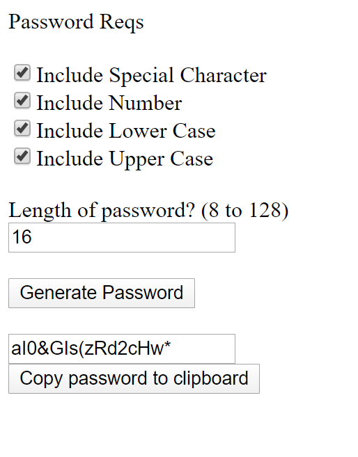

A simple password generator for creating randomized passwords based on the user's parameters.
-Special char list: " ","!",""","#","$","%","&","'","(",")","*","+",",","-",".","/",":",";","<",">","=","?","@","[","]","\","^","_","`","{","|","}","~"
-Numbers char list: 0,1,2,3,4,5,6,7,8,9
-Alpha char list: 26 letter english alphabet

https://cronint11.github.io/Projects/PwdGen/